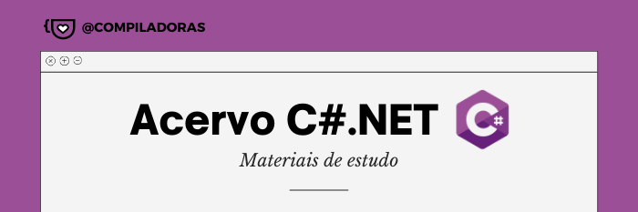

# Acervo C#.NET

  

Um repositório colaborativo para compartilhar materiais da linguagem C#.

## Como compartilhar materiais?

Acesse o arquivo [CONTRIBUTING.md](CONTRIBUTING.md) para obter mais informações de como contribuir nesse projeto.

### Outras dicas
* Mantenha os links organizados em ordem alfabética
* Use a aba de [issues](https://github.com/compiladoras/acervo-c-sharp/issues) para obter ideias do que adicionar ou crie uma nova issue!
* Fique a vontade para adicionar mais sessões (como a de livros). Você pode encontrar mais [emojis do github aqui](https://gist.github.com/rxaviers/7360908)

---

### Cursos 🎓

| Nome/Link | Descrição | Grátis | Idioma |
| -------- | -------- | -------- | -------- |
|  [Alura](https://www.alura.com.br/formacao-c-sharp-orientacao-objetos) | Formação completa em C# e orientação de objetos | ❌ | 🇧🇷 |
|  [C# 101](https://channel9.msdn.com/Series/CSharp-101/?WT.mc_id=Educationalcsharp-c9-scottha) | Vídeos com conceitos para iniciantes de C# (legendado) | ✅ | 🇧🇷 |
|  [Curso de C# para Iniciantes](https://www.youtube.com/playlist?list=PLwftZeDnOzt3VMtat5BTJvP_7qgNtRDD8) | Curso para iniciantes do Ray Carneiro | ✅ | 🇧🇷 |
|  [Fundamentos do C#](https://balta.io/cursos/fundamentos-csharp) | Fundamentos do C# com o instrutor André Baltieri | ✅ | 🇧🇷 |
|  [Linguagem de Programação C# - Básico](https://www.ev.org.br/cursos/linguagem-de-programacao-c-basico) | Curso para iniciantes da Fundação Bradesco | ✅ | 🇧🇷 |
|  [Microsoft Learn](https://docs.microsoft.com/pt-br/learn/browse/?products=dotnet&resource_type=learning%20path) | Roteiros de aprendizagem com cursos oficiais da Microsoft, a plataforma de estudo é em texto e recomendo | ✅ | 🇧🇷 |

### Sites e artigos 📝

| Nome/Link | Descrição | Grátis | Idioma |
| -------- | -------- | -------- | -------- |
|  [Documentação do C#](https://docs.microsoft.com/pt-br/dotnet/csharp/) | Documentação oficial da linguagem | ✅ | 🇧🇷 |
|  [Mês do C#: Roteiro de estudos para iniciantes](https://dev.to/compiladoras/mes-do-c-roteiro-de-estudos-para-iniciantes-2a1e) | Artigo com roteiro de estudos usando a plataforma Microsoft Learn | ✅ | 🇧🇷 |

### Youtube/Vídeos 🎥

| Nome/Link | Descrição | Grátis | Idioma |
| -------- | -------- | -------- | -------- |
|  [.NET (A Plataforma Completa de Desenvolvimento de Softwares) // Dicionário do Programador](https://www.youtube.com/watch?v=hlgm_1Bzt-4) | Vídeo falando sobre o que é .NET | ✅ | 🇧🇷 |
|  [C# // Dicionário do Programador](https://www.youtube.com/watch?v=NXVQasys0B8) | Vídeo falando sobre o que é a linguagem | ✅ | 🇧🇷 |

### Comunidades 👪

| Nome/Link | Descrição | Grátis | Idioma |
| -------- | -------- | -------- | -------- |
|  [.NET São Paulo](https://www.meetup.com/dotnet-Sao-Paulo/) | Comunidade com diversos eventos online e gratuitos sobre .NET/C# | ✅ | 🇧🇷 |
|  [DotNet BR](https://t.me/dotnetbr) | Grupo do Telegram para falar sobre .NET e suas linguagens | ✅ | 🇧🇷 |

### Úteis 🧰

| Nome/Link | Descrição | Grátis | Idioma |
| -------- | -------- | -------- | -------- |
|  [Roadmap C#.NET](https://github.com/MoienTajik/AspNetCore-Developer-Roadmap) | Mapa de estudos completo em C#.NET | ✅ | 🇺🇸 |
|  [Visual Studio 2019](https://visualstudio.microsoft.com/vs/community/) | Download gratuito da IDE oficial para desenvolvimento em C# | ✅ | 🇺🇸 |
